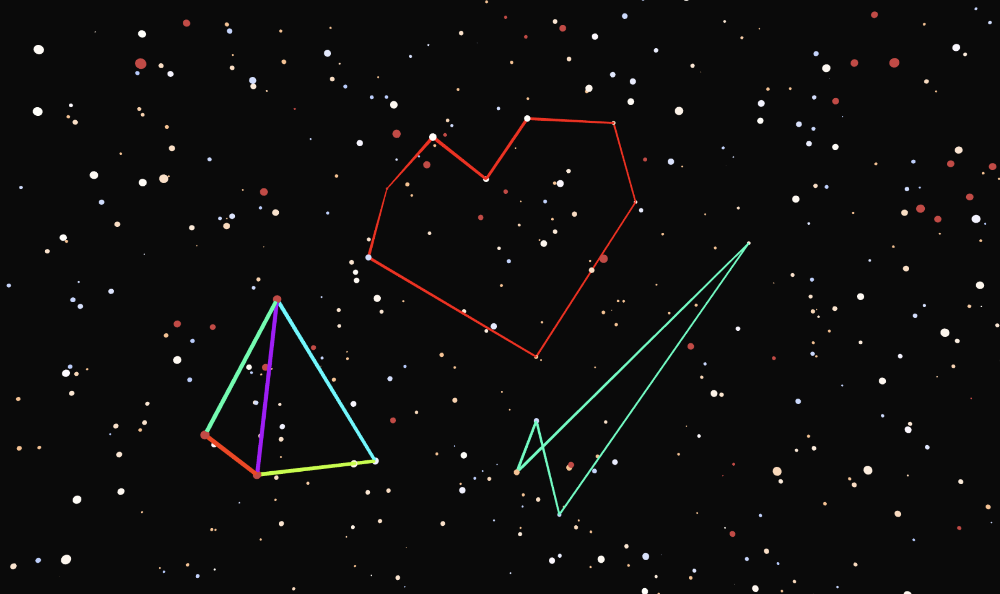

# Welcome to Nightsky

## What is Nightsky?

The ***[Gaia](https://www.esa.int/Space_in_Member_States/Germany/Die_Mission_Gaia_im_Ueberblick)*** spacecraft is a astrometric observatory built by the EADS Astrium and owned by the ***[European Space Agency (ESA)](https://www.esa.int/)***. Since its launch in 2013, Gaia’s aim is to create a very precise three-dimensional map of our Milky Way galaxy. During its runtime, Gaia not only recorded the position of over thousand million stars, 
but also their motions, luminosity, temperature and composition. It is focused on delivering a better understanding of the origin and history of our own galaxy. The data collected by the observatory so far has been released in three batches.

This project takes advantage of the third data release to create a browser-based three-dimensional visualization of the 10.000 brightest stars. To achieve this, it uses WebGL as the JavaScript API for rendering three-dimensional scenes in the browser. The project is incredibly lightweight, which enabled direct deployment using GitHub Pages.

The visualization is not limited to the Gaia dataset. It also displays the star signs visible from Earth and allows users to draw, export and share their own star sign designs.

---

## Why is Nightsky?

Nightsky was created as part of the software practical **Visual Computing** at the ***[university of Heidelberg](https://www.uni-heidelberg.de/de)***. The Gaia datasets have been visualized plenty of times before. The focus of this project was to bring portability to the data release, as most of the 
existing visualizations need to be downloaded and installed. Nightsky runs reliably in almost every modern browser.

---

## Where is Nightsky?

There are two ways to access Nightsky:

1. I deployed the project as a static webpage using GitHub Pages at ***[Nightsky](https://thorsten-trinkaus.github.io/Nightsky/)***

2. If you somehow want to run this project locally, you can use the provided ***[run.sh](run.sh)*** script. This method needs ***[Node.js](https://nodejs.org/en)*** and ***[http-server](https://www.npmjs.com/package/http-server)*** to be installed.

The ***[report](./report/report.pdf)*** for this practical is also available.